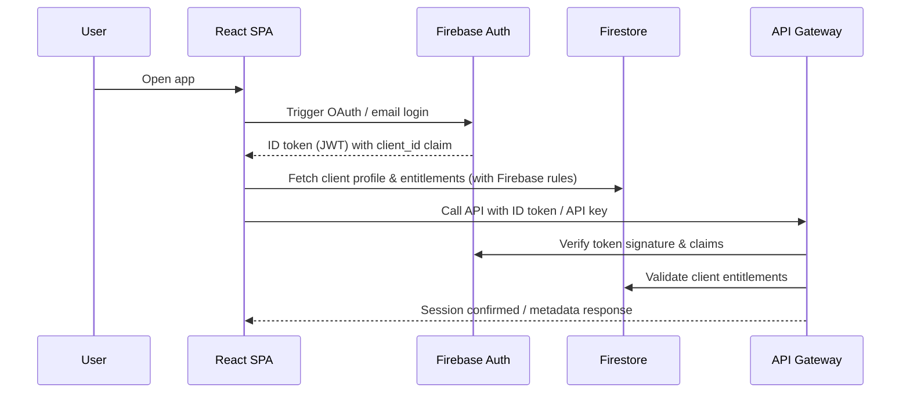
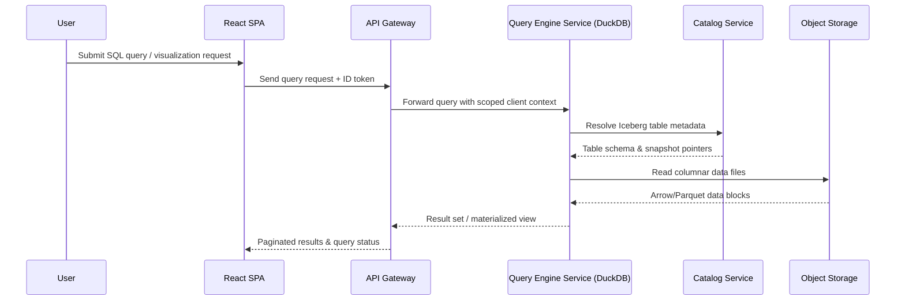
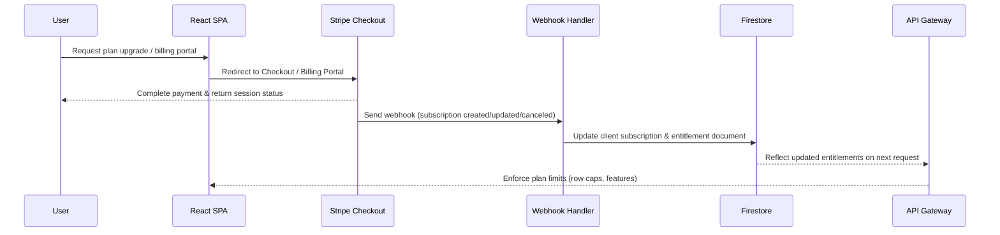

# Architecture Overview

## Purpose
This document captures the frozen Phase 0 architecture, shared design principles, and end-to-end flows for authentication, querying, and billing. The architecture emphasizes a cloud-agnostic, modular SaaS analytics platform capable of running on Google Cloud today with clear seams for future providers.

## Design Principles
- **Cloud portability by abstraction** – every integration point (object storage, query engine, auth) is wrapped behind internal interfaces so that vendor-specific logic is isolated.
- **Security-first multi-tenancy** – identity is rooted in Firebase Authentication with Firestore security rules enforcing per-`client_id` data access and API key scoping.
- **Separation of data and control planes** – DuckDB-based data plane stays stateless and focuses on query execution, while Firestore manages entitlements, metadata, and operational state.
- **Serverless-friendly operations** – core services (API gateway, query engine, webhook handlers) are deployable on Cloud Run or similar containerized runtimes to minimize infrastructure management.
- **Event-driven entitlements** – Stripe webhooks drive near real-time updates to subscription status, ensuring billing changes propagate immediately to the control plane.
- **Observability baked in** – each service emits structured logs and metrics (e.g., query latency, authentication failures) to support proactive monitoring and future SLOs.
- **Extensibility by contract** – pluggable interfaces exist for storage, catalog, and compute, enabling future adoption of Trino, BigQuery, or Snowflake without rewriting the application surface area.

## Component Diagram
```mermaid
graph LR
    subgraph Frontend
        SPA[React + Vite SPA]
    end

    subgraph ControlPlane[Control Plane]
        APIGW[API Gateway (Cloud Run)]
        Auth[Firebase Authentication]
        Firestore[Firestore (Client Metadata & Entitlements)]
        Catalog[Catalog Service (Iceberg REST or custom)]
        Webhooks[Stripe Webhook Handler]
    end

    subgraph DataPlane[Data Plane]
        QuerySvc[Query Engine Service (DuckDB)]
        IcebergTables[Apache Iceberg Tables]
        ObjectStore[Object Storage (GCS/S3/Azure)]
    end

    subgraph Billing
        Stripe[Stripe Checkout & Billing Portal]
    end

    SPA -->|Login / Token| Auth
    SPA -->|Fetch metadata| Firestore
    SPA -->|REST / GraphQL| APIGW
    APIGW -->|Verify JWT / API Key| Auth
    APIGW -->|Client context| Firestore
    APIGW -->|Submit query plan| QuerySvc
    QuerySvc -->|Read metadata| Catalog
    Catalog -->|Table manifests| IcebergTables
    QuerySvc -->|Columnar data| ObjectStore
    QuerySvc -->|Results| APIGW
    Stripe -->|Checkout session| SPA
    Stripe -->|Subscription events| Webhooks
    Webhooks -->|Update entitlements| Firestore
    Firestore -->|Policy lookup| APIGW
```

## Authentication Flow


## Query Flow


## Billing & Entitlement Flow


## Deployment Considerations
- **API Gateway & Query Engine** – packaged as container images and deployed on Cloud Run (or AWS Fargate/Azure Container Apps in future) with autoscaling based on concurrent query load.
- **Catalog Service** – starts with the Iceberg REST catalog backed by Firestore/GCS; abstraction layer enables swapping with AWS Glue, Snowflake, or custom metadata stores.
- **Object Storage** – initial implementation targets Google Cloud Storage, with interface parity to support S3 and Azure Blob Storage. Data lifecycle policies manage cost.
- **Secrets & Configuration** – sensitive configuration (Stripe keys, Firebase service account) stored in Secret Manager and injected via environment variables.
- **Observability** – integrate Cloud Logging/Stackdriver for logs, Cloud Trace for latency analysis, and export metrics to Prometheus-compatible sinks.
- **Data Governance** – implement audit logging for query execution, maintain table-level ACLs via entitlements, and support GDPR data deletion through Iceberg metadata operations.
